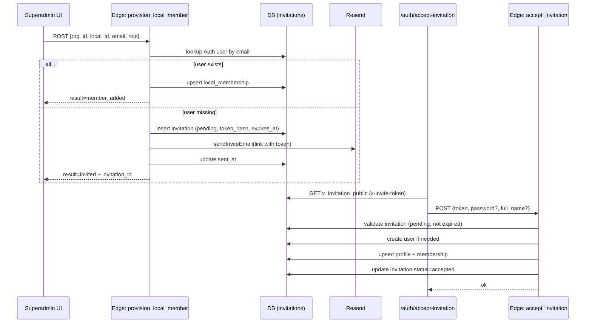

# Invitations Pipeline Audit (Superadmin) — ONBO

## 1) Scope and goal

This document summarizes the current invitation + acceptance pipeline used by Superadmin flows, so it can be reused for Org Admin without changes to contracts or logic.

## 2) Source of truth (code)

- Edge functions:
  - supabase/functions/provision_local_member/index.ts
  - supabase/functions/provision_org_admin/index.ts
  - supabase/functions/resend_invitation/index.ts
  - supabase/functions/accept_invitation/index.ts
- Email helper + template:
  - supabase/functions/\_shared/email.ts
  - supabase/functions/\_shared/email/templates/invite.ts
- Client invoke helper:
  - lib/invokeEdge.ts
- UI entry points:
  - app/superadmin/locals/[localId]/members/new/page.tsx
  - app/superadmin/organizations/[orgId]/page.tsx
  - app/auth/accept-invitation/page.tsx
- Docs:
  - docs/onboarding-provisioning.md
  - docs/screens/auth-accept-invitation.md
  - docs/screens/superadmin-add-local-member.md
  - docs/screens/superadmin-org-admins-management.md
  - docs/screens-data-map.md

## 3) Pipeline summary

- Invitations are stored in public.invitations with token_hash (sha256 of token).
- Email is sent via Resend API with link:
  - ${APP_URL}/auth/accept-invitation?token=...
- Acceptance uses Edge function accept_invitation with token payload.
- Memberships are created in org_memberships or local_memberships depending on invited_role.

## 4) Edge functions and contracts

### 4.1 provision_local_member

- Path: /functions/v1/provision_local_member
- Auth: requireAuthUser; allowed if superadmin OR org_admin(org_id)
- Input (JSON):
  - org_id: uuid
  - local_id: uuid
  - email: string (trim + lower)
  - role: 'aprendiz' | 'referente'
- Behavior:
  - If user exists in Auth (admin REST lookup):
    - Upsert profile (ensure email)
    - Upsert local_memberships (status=active)
    - Returns mode=assigned_existing_user, result=member_added
  - If user does not exist:
    - Create or reuse invitation (status pending)
    - token = generateToken(); token_hash = sha256(token)
    - expires_at = now + 7 days
    - sendInviteEmail (Resend)
    - update invitations.sent_at
    - Returns mode=invited_new_user, result=invited
- Response (success):
  - assigned_existing_user:
    - { ok:true, mode:'assigned_existing_user', result:'member_added', email, user_id, local_id, membership }
  - invited_new_user:
    - { ok:true, mode:'invited_new_user', result:'invited', email, invitation_id, sent_at }

### 4.2 provision_org_admin

- Path: /functions/v1/provision_org_admin
- Auth: requireAuthUser; superadmin only
- Input (JSON):
  - org_id: uuid
  - email: string (trim + lower)
- Behavior:
  - If user exists in Auth:
    - Upsert profile (ensure email)
    - Upsert org_memberships (role=org_admin, status=active)
    - Returns mode=assigned_existing_user, result=member_added
  - If user does not exist:
    - Insert invitation (org_id, local_id=null, invited_role='org_admin')
    - token = generateToken(); token_hash = sha256(token)
    - expires_at = now + 7 days
    - sendInviteEmail (Resend)
    - update invitations.sent_at
    - Returns mode=invited_new_user, result=invited
- Response (success):
  - assigned_existing_user:
    - { ok:true, result:'member_added', mode:'assigned_existing_user', org_id, email, user_id, membership_id }
  - invited_new_user:
    - { ok:true, result:'invited', mode:'invited_new_user', org_id, email, invitation_id, resent_at }

### 4.3 resend_invitation

- Path: /functions/v1/resend_invitation
- Auth: requireAuthUser; allowed if superadmin OR org_admin(org_id)
- Input (JSON):
  - invitation_id: uuid
- Behavior:
  - Loads invitation by id
  - If status != pending -> error
  - If expired:
    - mark existing as expired
    - create new invitation (pending) with new token_hash/expires_at
  - Else:
    - update token_hash/expires_at on existing
  - Ensures local_name when local_id present (org_admin invites require local_id)
  - sendInviteEmail (Resend)
  - updates invitations.sent_at
- Response (success):
  - { ok:true, invitation_id, resent_at }

### 4.4 accept_invitation

- Path: /functions/v1/accept_invitation
- Auth:
  - Can be anonymous (no JWT) for first-time user
  - If JWT present, uses it to detect existing user
- Input (JSON):
  - token: string (required)
  - password: string (required if user not logged in)
  - full_name: string (required if profile has no full_name)
- Behavior:
  - Find invitation by token_hash, status=pending, expires_at > now
  - If JWT present:
    - Uses admin.auth.getUser(jwt)
  - If no JWT:
    - If profile exists with same email -> 409 login required
    - Create auth user (email_confirm=true)
  - Upsert profile (email, full_name)
  - If invited_role == org_admin:
    - Upsert org_memberships (role=org_admin, status=active)
  - Else (aprendiz/referente):
    - Requires local_id
    - Upsert local_memberships (role from invitation)
  - Update invitation status=accepted, accepted_at=now
- Response (success):
  - { ok:true, org_id, local_id, role, user_id, membership_id, profile_updated }

## 5) Client acceptance route

- Route: /auth/accept-invitation?token=...
- Fetches context via REST:
  - GET /rest/v1/v_invitation_public with header x-invite-token
- Validates:
  - status pending
  - expires_at in future
- On submit:
  - If session exists, updates password client-side, then calls accept_invitation
  - Else calls accept_invitation with password
- full_name:
  - Required if profile is missing full_name

## 6) Token + email pipeline

- Token generation:
  - generateToken() -> sha256Bytea(token) stored in invitations.token_hash
- Email send:
  - sendInviteEmail() uses Resend API
  - Template builds link: APP_URL/auth/accept-invitation?token=...
- Metadata:
  - invitations.sent_at set after successful send

## 7) Status and expiry

- INVITE_DAYS = 7
- Status transitions:
  - pending -> accepted (accept_invitation)
  - pending -> expired (resend_invitation if expired)
- accept_invitation only accepts pending + unexpired

## 8) Initiator permissions

- provision_local_member:
  - superadmin OR org_admin(org_id)
- provision_org_admin:
  - superadmin only
- resend_invitation:
  - superadmin OR org_admin(org_id)

## 9) Mermaid flow (superadmin local invite)

## 10) Notes for reuse in Org Admin

- Org Admin already uses this pipeline for local invites (provision_local_member).
- For org_admin invites from superadmin, provision_org_admin is the entry point.
- Resend + accept_invitation are shared across roles via invitations table.
